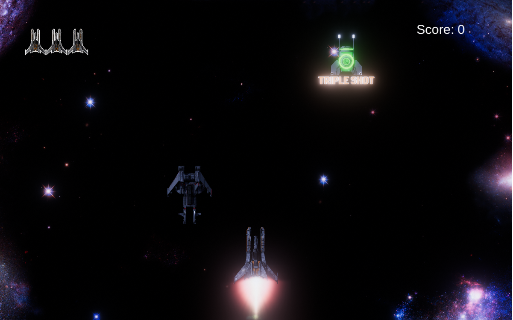
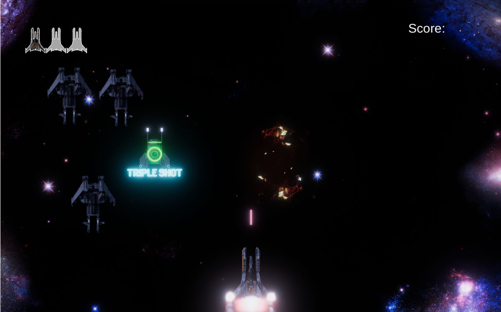
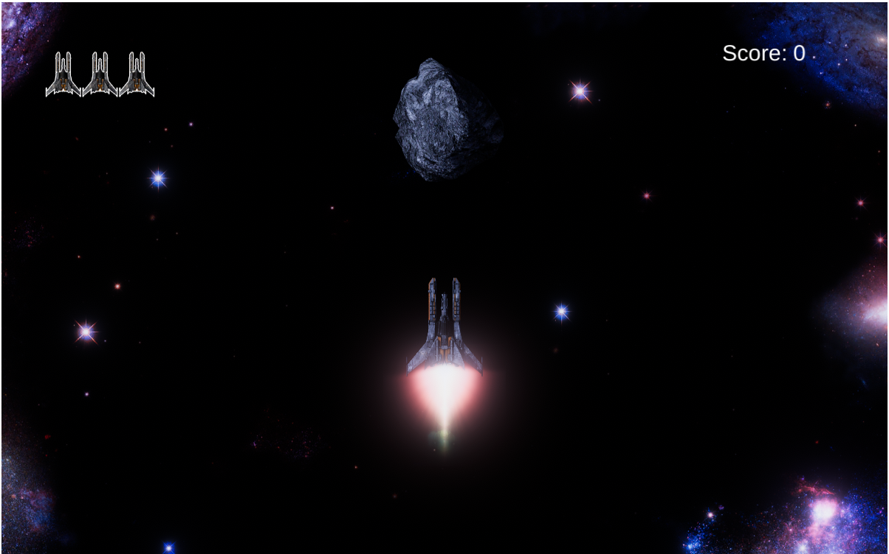

# Galaxy Shooter

Galaxy Shooter is an exciting 2D space shooter game where players control a spaceship and battle against waves of enemy ships. Survive as long as possible, collect power-ups, and defeat powerful bosses to achieve the highest score!

## 🖼️ Screenshots

Galaxy Shooter is an exciting 2D space shooter game where players control a spaceship and battle against waves of enemy ships. Survive as long as possible, collect power-ups, and defeat powerful bosses to achieve the highest score!

## 🎮 Play the Game

👉 [Play Now](https://bytejutsu.github.io/Galaxy_Shooter/)

## 📺 Watch Gameplay

🎥 [YouTube Video](https://youtu.be/uG3FNcwS3Hc)

## 🛠 Features

- 🚀 Classic arcade-style space shooter gameplay
- 💥 Power-ups to enhance firepower and shields
- 🌌 Dynamic space environment with immersive sound effects
- 🎮 Smooth and responsive controls

## 🔧 Controls

- **Arrow Keys / WASD** - Move the spaceship
- **Spacebar** - Fire weapons

## 🚀 How to Play

1. Use the controls to navigate your spaceship through space.
2. Shoot enemies and avoid incoming attacks.
3. Collect power-ups to boost your firepower and defense.
4. Survive for as long as possible and defeat bosses to earn a high score!

## 🔨 Development

- **Engine:** Unity
- **Language:** C#
- **Platform:** WebGL (Playable in the browser)
- **Made by:** ByteJutsu

